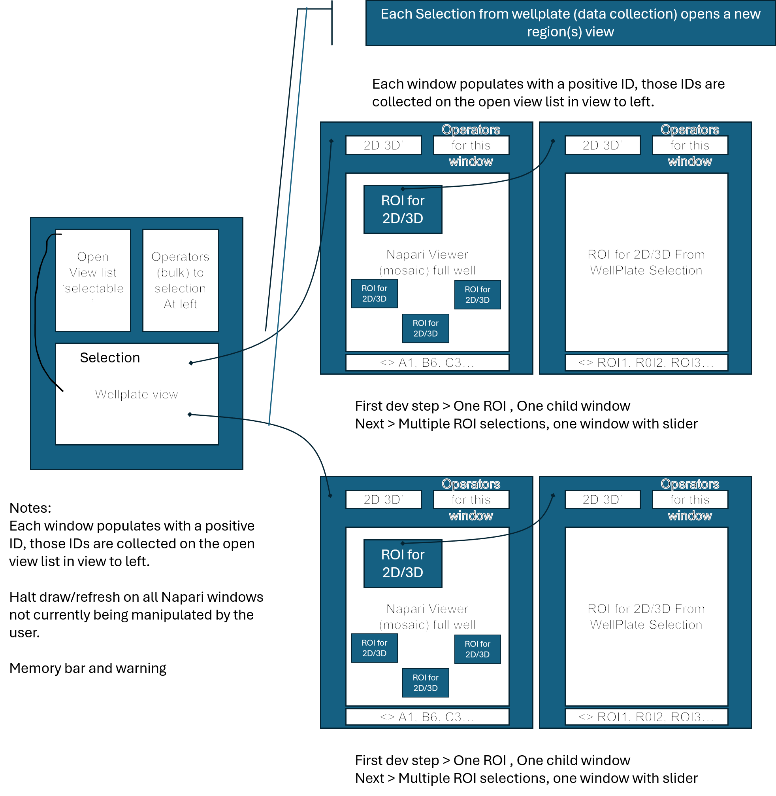

# SquidXplorer

A local viewer for finished Squid HCS acquisitions. Open a plate, explore any well or region in its
own napari window, and run your processing operators on exactly the wells or ROIs you pick. Read
only: it never changes your acquisition and never runs the microscope.

## The idea

The **plate is the root**. Selecting wells opens an independent napari window over them; drawing an
ROI inside a window opens a **child window** over that region. Every window gets an integer id, and
they are all collected in the **Window navigator** on the left.

**Layout (from the design deck):**

- **Root**: the Window navigator (a selectable list of open views) and the bulk Operators, above the
  Wellplate view with its Selection.
- **Each window**: a 2D / 3D control and Operators for that window, over the napari mosaic of the
  full well, with ROI boxes you can send to 2D or 3D, and a region slider `<> A1, B6, C3 ...`.
- **An ROI child window** is the same, with a slider over its ROIs `<> ROI1, ROI2, ROI3 ...`.

**Notes:**

- Each selection from the wellplate opens a new region view. Each window gets a positive id,
  collected in the Window navigator on the left.
- Windows not currently being manipulated halt their draw and refresh.
- A memory bar warns you before the system runs low.

## Operators

Processing runs **your own tested implementations, called directly**, never a reimplementation:

| Operator | Backend |
| --- | --- |
| Deconvolution (Richardson-Lucy, vectorial PSF) | `petakit` |
| Stitch and flat-field | `tilefusion` |
| Background subtraction | `bgsub` |
| Nuclei detection | Cellpose |
| Maximum intensity projection | built in |

Output is byte-identical to the standalone repos, pinned by `tests/test_operator_fidelity.py`.
Results are OME-Zarr layers you toggle on and off; the raw data on disk is never touched.

## Setup (Windows, one time)

- You need Python 3.10, 3.11, or 3.12. If you do not have it, install from
  https://www.python.org/downloads/ and tick "Add python.exe to PATH".
- Open PowerShell in the tool folder and run:
  `powershell -ExecutionPolicy Bypass -File scripts\Setup-Windows.ps1`
- This puts a **SquidXplorer** shortcut on your Desktop.
- To update later: `git pull` in the folder, then open the icon again.

## Open an acquisition

- Launch SquidXplorer. A small console opens beside it; that is normal and shows progress.
- **File, then Open acquisition folder**, and pick the acquisition (the folder holding the `0`
  folder and/or the `ome_tiff` folder).
- It reads both Squid formats (individual TIFFs and OME-TIFF), on 384 and 1536 plates.

## Explore

- **Click** a well to select it, **Shift-drag** a box or **Shift/Ctrl-click** to select several,
  then **Open view** to open them as one window.
- Inside a window: **2D / 3D**, draw an **ROI** and send it to its own child window, and run an
  **operator** on that view.
- The **Window navigator** lists every open view; select rows to highlight their wells on the
  plate, and **Collapse all** when the desktop gets busy.
